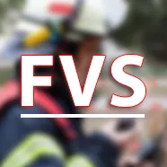

 󠂪󠂪

# FVS | Funk- und Verwaltungssoftwaren

### Über uns

Wir sind ein noch kleines Projekt, was euch Programme für euer Funkspiel, RolePlay oder ähnliches zur Verfügung stellt.
Noch sind wir im Aufbau, aber ganz bald werden wir unser erstes Produkt für euch anbieten können!

### Das Team dahinter

| Mitglied | Tätigkeitsbereich | Zeitspanne |
|----------|-------------------|----------------|
| [Oliver][oliverdiscord]  | Founder & Head of Development | seit 12.08.2021 |
| [David][daviddiscord]   | Head of Development | seit 12.08.2021 |
| [Sturmi][sturmidiscord]  | Head of Marketing & Support | seit 12.08.2021 |
| [Nicolas][nicolasdiscord] | Internal Management & Supervisor | seit 12.08.2021 |
| [Yannis][yannisdiscord]  | Support | seit 12.08.2021 |

[oliverdiscord]: https://discord.com/users/144843565040795648
[daviddiscord]: https://discord.com/users/325719042113536000
[sturmidiscord]: https://discord.com/users/231878626226864128
[nicolasdiscord]: https://discord.com/users/421786381547995136
[yannisdiscord]: https://discord.com/users/224302213860687873

